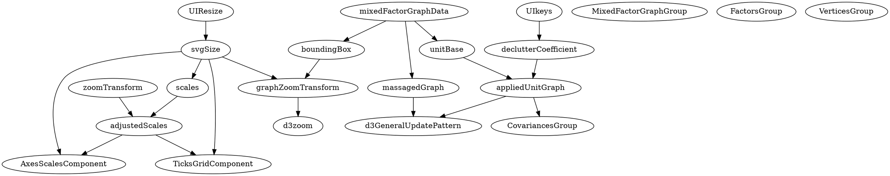

# Factor Graph reactivity

```dot
digraph{
  svgSize // signal
  zoomTransform // signal
  scales
  adjustedScales
  mixedFactorGraphData // signal
  unitBase
  massagedGraph
  boundingBox
  appliedUnitGraph
  graphZoomTransform
  declutterCoefficient // signal
  TicksGridComponent  // solid comp
  AxesScalesComponent // solid comp
  MixedFactorGraphGroup // svg group graph container (no scales nor grid)
  CovariancesGroup
  FactorsGroup
  VerticesGroup

  UIkeys -> declutterCoefficient
  UIResize -> svgSize

  svgSize -> scales
  scales -> adjustedScales
  zoomTransform -> adjustedScales
  mixedFactorGraphData -> { unitBase, massagedGraph, boundingBox }
  boundingBox -> graphZoomTransform
  svgSize -> graphZoomTransform // untrack

  declutterCoefficient -> appliedUnitGraph // f-memo
  unitBase -> appliedUnitGraph // f-memo 

  subgraph d3GeneralUpdatePattern{
    // inside a creeateEffect
  }

  appliedUnitGraph -> d3GeneralUpdatePattern
  massagedGraph -> d3GeneralUpdatePattern

  subgraph d3zoom{
    // inside a createEffect
  }

  graphZoomTransform -> d3zoom


  svgSize -> TicksGridComponent
  adjustedScales -> TicksGridComponent
  svgSize ->AxesScalesComponent
  adjustedScales ->AxesScalesComponent

  appliedUnitGraph -> CovariancesGroup
}
```

