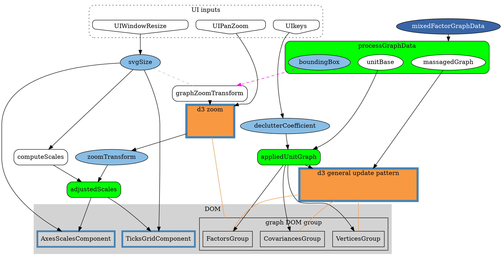

# Factor Graph reactivity

The reactivity graph and interactions with user events and d3 stuff.

```dot
digraph{
  compound=true
  svgSize [style=filled fillcolor="#88bee6"] // signal
  zoomTransform [style=filled fillcolor="#88bee6"] // signal
  declutterCoefficient [style=filled fillcolor="#88bee6"] // signal 
  mixedFactorGraphData [style=filled fillcolor="#3865a6" fontcolor=white] // signal // signal/store
  computeScales [shape=rectangle style=rounded] // f 
  adjustedScales  [shape=rectangle style="filled,rounded" fillcolor=green]// f-memo
  appliedUnitGraph  [shape=rectangle style="filled,rounded" fillcolor=green]// f-memo
  graphZoomTransform  [shape=rectangle style="rounded"]// f

  subgraph cluster_UI{
    label="UI inputs"
    style="dotted,rounded"
    UIkeys [shape=invhouse style="rounded"]
    UIWindowResize [shape=invhouse style="rounded"]
    UIPanZoom [shape=invhouse style="rounded"]
  }

  UIkeys -> declutterCoefficient
  UIWindowResize -> svgSize
  UIPanZoom -> d3zoom [lhead=cluster_d3zoom]

  svgSize -> computeScales
  computeScales -> adjustedScales
  zoomTransform -> adjustedScales
  mixedFactorGraphData -> massagedGraph  [lhead=cluster_processGraphData]
  boundingBox -> graphZoomTransform [style=dashed color=magenta]
  svgSize -> graphZoomTransform [arrowhead="none" color=grey style=dashed] // untrack

  declutterCoefficient -> appliedUnitGraph // f-memo
  unitBase -> appliedUnitGraph // f-memo 

  appliedUnitGraph -> d3GeneralUpdatePattern [lhead=cluster_d3GeneralUpdatePattern]
  massagedGraph -> d3GeneralUpdatePattern [lhead=cluster_d3GeneralUpdatePattern]
  d3GeneralUpdatePattern -> { FactorsGroup, CovariancesGroup, VerticesGroup } [ltail=cluster_d3GeneralUpdatePattern color="#f89840" arrowhead=none] 

  subgraph cluster_d3zoom{
    // inside a createEffect
    shape=house
    style=filled
    fillcolor="#f89840"
    color=steelblue
    penwidth=5.0
    d3zoom [style=invis]
    label="d3 zoom"
  }

  d3zoom -> FactorsGroup [ltail=cluster_d3zoom lhead=cluster_MixedFactorGraphGroup color="#f89840" arrowhead=none]

  graphZoomTransform -> d3zoom [lhead=cluster_d3zoom]

  d3zoom -> zoomTransform  [ltail=cluster_d3zoom]


  svgSize -> TicksGridComponent
  adjustedScales -> TicksGridComponent
  svgSize ->AxesScalesComponent
  adjustedScales ->AxesScalesComponent

  appliedUnitGraph -> CovariancesGroup
  appliedUnitGraph -> FactorsGroup
  appliedUnitGraph -> VerticesGroup

  subgraph cluster_DOM {
    label = "DOM";
    style=filled;
    color=lightgrey;
    TicksGridComponent [shape=box color=steelblue penwidth=4]// solid comp
    AxesScalesComponent [shape=box color=steelblue penwidth=4]// solid comp
    subgraph cluster_MixedFactorGraphGroup{
      style=boxed;
      color=black
      label = "graph DOM group";
      CovariancesGroup [shape=box]
      FactorsGroup [shape=box]
      VerticesGroup [shape=box]
    }
  }

  subgraph cluster_processGraphData{
    style="filled,rounded"
    fillcolor=green
    label="processGraphData"
    boundingBox [style=filled fillcolor="#88bee6"] // signal 
    unitBase [style=filled fillcolor=white]
    massagedGraph [style=filled fillcolor=white]
  }

  subgraph cluster_d3GeneralUpdatePattern{
    // inside a creeateEffect
    label="d3 general update pattern"
    shape=house
    color=steelblue
    penwidth=5.0
    style=filled
    fillcolor="#f89840"
    d3GeneralUpdatePattern [style="invis"]
    rank=sink;
  }
}
```

